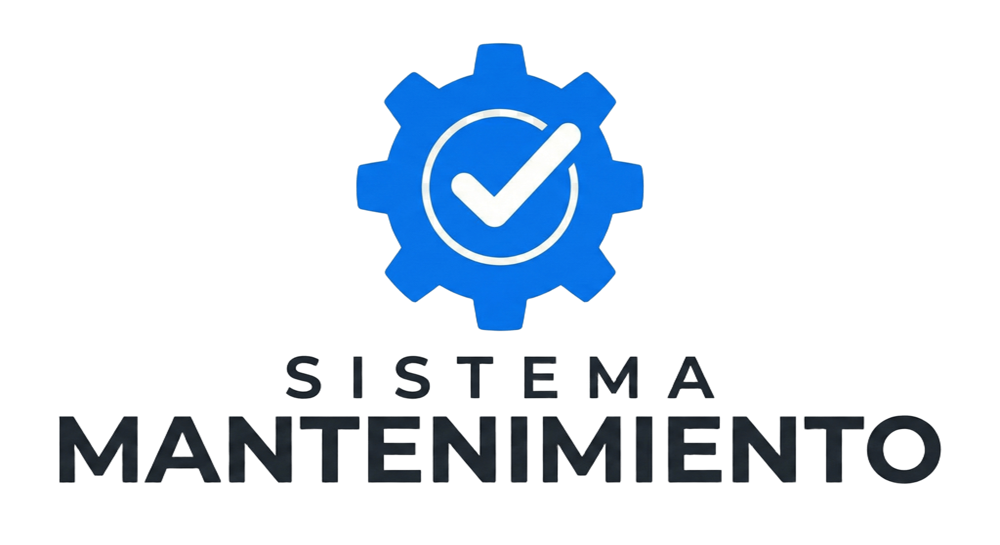

<p align="center">
  
</p>

<h1 align="center">SIGM &mdash; Gestión de Mantenimiento de Flotillas v2</h1>

<p align="center">
  <em>"Optimización operativa para tractocamiones: Máxima disponibilidad, cero registros en papel."</em>
</p>

<p align="center">
  
  
  
</p>

<p align="center">
  <a href="#instalación-y-uso">
    
  </a>
  <a href="#especificaciones-técnicas">
    
  </a>
</p>

<p align="center">
  <a href="#contacto">
    
  </a>
</p>

<p align="center">
  <a href="https://youtu.be/tu-video-demo">
    
  </a>
</p>

---

# 📋 Descripción del Proyecto
Este sistema es una solución digital especializada en la **administración y control operativo de flotillas de tractocamiones**. Está diseñado para centralizar la información técnica de unidades de carga pesada, permitiendo gestionar ciclos de mantenimiento complejos y garantizar que la flota se mantenga en ruta el mayor tiempo posible.

El enfoque es 100% **técnico-operativo**, priorizando la trazabilidad mecánica de cada unidad sobre los análisis financieros, ideal para jefes de taller y administradores de flota.

## ✨ Características Principales
* **Gestión de Unidades (Tractos):** Control por número de económico, modelo y estado operativo.
* **Mantenimiento Preventivo:** Programación basada en horómetros o kilometraje para evitar paros no programados.
* **Bitácora de Reparaciones:** Historial crítico de cada unidad para identificar fallas recurrentes.
* **Control de Refacciones:** Inventario de piezas de alto movimiento (filtros, balatas, bandas).
* **Gestión de Operadores:** Asignación de responsables y reportes de fallas en ruta.

## 🛠️ Especificaciones Técnicas
* **Base de Datos:** MySQL
* **Lenguajes:** PHP, JavaScript, CSS
* **Entorno:** Optimizado para **Navegadores**.

## 🚀 Instalación y Uso

Sigue estos pasos para configurar el entorno de desarrollo local en tu navegador:

### 1. Requisitos Previos
Asegúrate de tener instalado un servidor local (como XAMPP o LAMP stack):
* **PHP** (7.4 o superior)
* **MySQL / MariaDB**
* **Servidor Apache**

### 2. Clonar el Repositorio
Abre tu terminal y ejecuta el siguiente comando para traer el código a tu máquina:
```bash
git clone [https://github.com/fran117-blip/proyecto-final.git]
```

## 🌐 Compatibilidad Web
El sistema ha sido testeado y optimizado para los siguientes navegadores modernos:
* **Google Chrome / Chromium** (Recomendado)
* **Brave Browser**
* **Mozilla Firefox**
* **Microsoft Edge**

> **Nota:** Se recomienda el uso de navegadores basados en **Chromium** para una mejor interpretación de los scripts de gestión de inventarios.

## 🧱 Estructura de Desarrollo
* **Frontend:** HTML5, CSS3 (Diseño moderno y elegante) y JavaScript para la interactividad de las tablas.
* **Backend:** PHP para el procesamiento de datos y lógica de negocio.
* **Servidor de Datos:** MySQL.
* **Servidor Web:** Recomendado Apache (XAMPP/LAMP).

## 🎨 Interfaz y Diseño
El diseño fue pensado para ser **moderno y elegante**, facilitando la lectura de datos técnicos complejos. La interfaz está optimizada para evitar la fatiga visual durante jornadas largas de administración de maquinaria.

## 👤 Autor
* **Francisco Javier** - *Estudiante de TSU en Mantenimiento de Maquinaria Pesada* - 

---
*Este proyecto fue desarrollado como parte de la formación académica en la Universidad Tecnológica de Nuevo Laredo (UTNL).*
